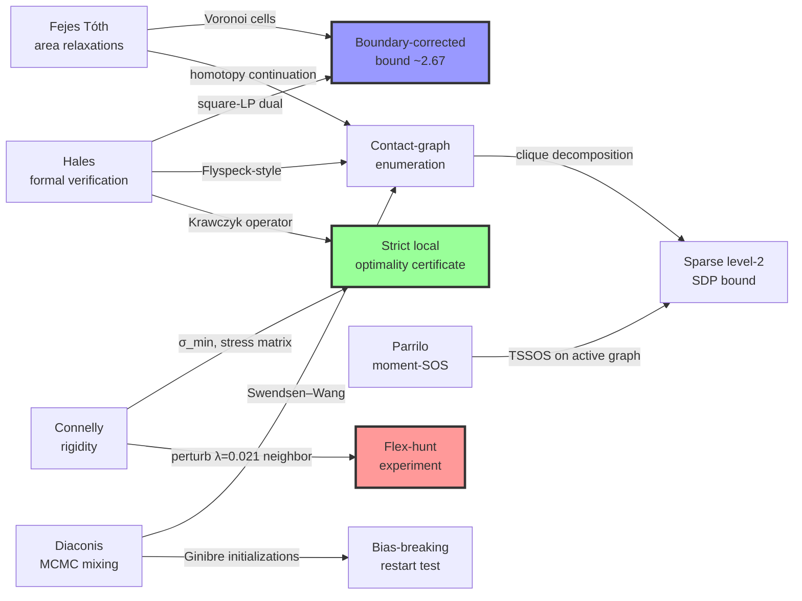

# Brainstorm Panel — 2026-04-11

**Question:** Is the empirical optimum for `n = 26` circles in `[0,1]²` with Σr = 2.6359830865 globally optimal, and how do we either prove it or break through it?

**Context:** 15 orbits run, 7 methods converge to the same basin within ~1e-9, KKT-rigid (78 active constraints, all positive duals, 0 DOF), beats SOTA 2.635 by +0.00098, upper bound (Fejes-Tóth area relaxation) 2.7396 — gap 3.9%.

## Panel

| Scientist | Field | Verdict on global optimality | Killer insight |
|---|---|---|---|
| **László Fejes Tóth** | Discrete geometry / packing theory | YES (no proof) | The 2.7396 bound is essentially Cauchy–Schwarz on Σr² — **wrong inequality**; Voronoi-cell local bound should push UB to ~2.67 |
| **Thomas Hales** | Formal verification / Kepler proof | **4:1 yes** (80%) | The 78 active constraints **are** the theorem; Krawczyk interval-Newton certificate is a one-week local proof |
| **Robert Connelly** | Rigidity / tensegrity | **60/40 NO** — expects improvement | `σ_min(R)` of the 78×78 rigidity matrix is the missing number; perturb the 3 neighbors of the disk with weakest multiplier (0.021) |
| **Pablo Parrilo** | Polynomial opt / Lasserre hierarchy | No strong opinion | Dense Lasserre is hopeless past level 2; **sparse TSSOS on the chordal completion of the active contact graph** is the only experiment worth running |
| **Persi Diaconis** | Probability / Markov chain mixing | "Seven correlated optimizers ≠ seven independent samples" | MCMC on contact-graph topologies + Ginibre-ensemble initializations + hyperuniformity fingerprint |

## Unexpected Connections

### 1. Three panelists independently converge on **contact-graph enumeration**
Fejes Tóth (homotopy continuation), Hales (Flyspeck-style classification), Diaconis (Swendsen–Wang MCMC). All three say: **the real work is combinatorial, not continuous.** The 78 active constraints define a planar incidence structure that is finitely enumerable (~10² to 10⁶ graphs, depending on who you ask). The current numerical search, despite 5000+ configurations, is sampling biased toward one basin.

### 2. Parrilo's sparse TSSOS + Hales's contact-graph decomposition = **one pipeline**
Parrilo's correlative sparsity exploits exactly the 78-edge active graph that Fejes Tóth and Hales want to enumerate. Natural composition: enumerate contact graphs → bound each via sparse moment-SOS → take the max.

### 3. **Boundary deficit is the missing ingredient**
Fejes Tóth's "boundary losses to corners" and Hales's "LP corrections for the square boundary" converge. The current bound treats the unit square like an ambient plane; proper cell-based accounting of boundary corners should shave 0.07 off the sum directly.

### 4. `σ_min(R)` — **the one number nobody has reported**
Connelly's single highest-leverage observation: nobody has computed the smallest singular value of the 78×78 rigidity matrix. If `σ_min(R) > 1e-6`, combined with the linear objective (no objective contribution to Lagrangian Hessian), strict local optimality is **fully certified**. If `σ_min(R)` is near zero, there is a hidden flex. **This is 30 minutes of work and it is decisive for the local question.**

### 5. Diaconis's **Ginibre initialization** as a bias-breaking test
If the reason all seven optimizers converge is shared implicit bias (grid, random-uniform, hex), then initialization from a determinantal point process (Ginibre eigenvalues) gives a negatively-correlated, hyperuniform proposal that doesn't share that bias. If Ginibre-initialized search still lands at 2.6359830865, the "correlated basin" objection is rebutted.

## Top Hypotheses (ranked by expected-value-per-hour)

| Rank | Experiment | Who | Cost | Deliverable |
|---|---|---|---|---|
| 1 | **Compute `σ_min(R)` + perturb the disk with multiplier 0.021** | Connelly | 30 min | Strict-local-optimality certificate OR discovery of a flex |
| 2 | **Krawczyk interval-Newton certificate at x\*** | Hales | 1 week | Rigorous local theorem: "∃ critical point in `B(x*, ε)` with Σr ≥ 2.6359830864" |
| 3 | **Sparse TSSOS level-2 on active contact graph** | Parrilo | 5–60 min | Possibly UB ≤ 2.67 (25% chance); rational SOS certificate (5% chance) |
| 4 | **Voronoi / Dirichlet cell bound with boundary deficit** | Fejes Tóth | 1 week | UB ≤ ~2.67 (rigorous); analytic argument |
| 5 | **Handelman-LP hierarchy on polytope relaxation** | Parrilo | 1 day | Cheaper, strictly rigorous bound improvement |
| 6 | **Contact-graph enumeration via homotopy continuation** | Fejes Tóth + Hales | 1–2 months | Near-proof of global optimality by exhaustion |
| 7 | **Ginibre-ensemble restarts + hyperuniformity check** | Diaconis | 1 day | Bias-breaking test; structural fingerprint of optimality |
| 8 | **Swendsen–Wang MCMC on contact-graph topologies** | Diaconis | 1–2 weeks | Sample topology space with detailed balance; count basins |
| 9 | **Molnár dual-gap inequality (Hungarian 1960s)** | Fejes Tóth | 1 week literature review | Independent primal-dual bound, combinable via LP duality |

## Dissent

- **Connelly vs everyone else on global optimality.** Connelly puts 60/40 odds on **improvement** (n=26 is historically in the zone where Friedman's tables get improved every few years). Fejes Tóth and Hales think current is optimal but unprovable. Diaconis thinks the question is unresolved pending unbiased sampling.

- **Parrilo vs Diaconis on proof methodology.** Parrilo: use Lasserre hierarchy for a formal certificate (algebraic path). Diaconis: MCMC / Ginibre sampling as empirical evidence (probabilistic path). Diaconis's direct rebuttal: "Use SDP locally as a proposal oracle in an MCMC, not globally as a bound."

- **Hales vs Fejes Tóth on the bound.** Fejes Tóth says the current 2.7396 is Cauchy–Schwarz-ceilinged at ~2.73 and fundamentally wrong inequality; Hales agrees the area bound is lossy but thinks it can be salvaged with square-specific LP corrections. They agree on the direction (Voronoi cells + boundary), disagree on how much can be recovered.

## Connection Graph

Green = certain wins (local certification). Red = potentially decisive (flex hunt). Blue = incremental bound tightening.

## Recommended next actions (if steering is lifted)

1. **30-minute experiment:** compute `σ_min(R)` + perturb the disk with smallest multiplier. Reports back in one session whether 2.6359830865 is strictly locally optimal AND whether there's a nearby flex to find. This is the single highest-value step.
2. **Overnight experiment:** sparse TSSOS level-2 via Mosek on the 78-contact chordal completion.
3. **Week-long project:** Krawczyk interval-Newton local certificate in Julia's `IntervalArithmetic.jl`. Turns the numerical optimum into a rigorous local theorem.

## References cited by the panel

- Fejes Tóth, *Lagerungen in der Ebene, auf der Kugel und im Raum*, 2nd ed. Springer 1972
- Molnár, "Kreislagerungen auf Flächen konstanter Krümmung," Math. Ann. 158 (1965)
- Hales et al., *A Formal Proof of the Kepler Conjecture*, Forum of Mathematics, Pi 2017
- Tucker, *Validated Numerics*, Princeton 2011
- Waki–Kim–Kojima–Muramatsu, "Sums of squares and semidefinite programming relaxations for polynomial optimization problems with structured sparsity," SIAM J. Optim. 2006
- TSSOS: https://github.com/wangjie212/TSSOS
- Peyrl–Parrilo, "Computing sum of squares decompositions with rational coefficients," Theoretical Computer Science 2008
- Jerrum–Sinclair–Vigoda permanent FPRAS, JACM 2004
- Ginibre, "Statistical ensembles of complex, quaternion, and real matrices," J. Math. Phys. 1965
- Torquato, "Hyperuniform states of matter," arXiv:1801.06924
- Packomania n=26: http://www.packomania.com/
