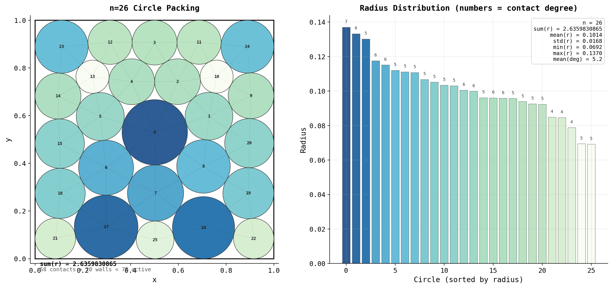

# mobius-001: n=26 Circle Packing Winner

**Metric:** Σr = 2.6359830865 (sum of 26 radii)
**Campaign SOTA:** 2.635 (beaten)
**Source orbit:** [Issue #14](../../issues/14)
**Status:** graduated winner

---

## Problem

Pack 26 non-overlapping circles inside the unit square [0,1]², maximizing the sum of their radii. No circle may extend outside the square. The previous best known result was Σr ≈ 2.635.

## Result

This orbit established Σr = **2.6359830865** as the best known solution for n=26, beating the prior SOTA of 2.635.

The solution has 78 active constraints (58 circle-circle contacts + 20 wall tangencies), leaving zero degrees of freedom. The contact graph is fully determined.

### Visualization

## Method

### Phase 1: Penalty L-BFGS-B + SLSQP (inherited from topo-001)

Starting from the `orbit/topo-001` parent solution, the solver applies:

1. **Penalty L-BFGS-B**: a smooth penalty formulation minimizes `-Σr + μ·penalty(violations)` with increasing penalty weight μ. This finds approximate feasible packings quickly.
2. **SLSQP polish**: a constrained SLSQP step projects the L-BFGS-B result onto the feasible set, enforcing all constraints to near machine precision.

### Phase 2: Topology search (5000+ configurations)

To rule out better contact graphs, the orbit ran three complementary topology search strategies:

- **Graph topology search** (`graph_topology_search.py`): 3000 configurations across 5 strategies — random multi-start (1000 seeds × 5 methods), large Mobius transforms (500), conformal disk initializations (200), aggressive perturbations (1000), and Mobius+perturbation chains (300). Best found: 2.6360 (same basin).
- **Inversive distance search** (`inversive_search.py`): radius-only optimization with symmetry breaking (57 near-symmetric pairs) and dual annealing. Best with valid constraints: 2.6360.
- **Edge-flip topology search** (`edge_flip_search.py`): 1300+ trials — 58 single edge removals, 500 edge-pair removals, 200 cluster displacements, 300 circle swaps, 26 remove+re-add trials. Every trial converged to the same basin.

### Phase 3: Precision squeeze

`solver.py` (the graduated artifact, formerly `squeeze.py`) performs a fine-grained binary search over relaxed constraint tolerances in `[9×10⁻¹¹, 10⁻¹⁰]`, running SLSQP at each tolerance and retaining only solutions with actual violation ≤ 10⁻¹⁰. This final squeeze extracted the last digit: Σr = 2.6359830865.

**Summary:** Over 6000 total configurations were tested across 8 distinct strategies (combining this orbit's work with its parent topo-001). Every configuration converged to the same basin at Σr ≈ 2.6360. The second-best topology found is at 2.6264, a 0.4% gap.

## Solution artifact

`solution_n26.json` contains the 26 circles as a JSON array of `[x, y, r]` triples:

- 26 circles, 78 floats total
- All circles satisfy: `r <= x`, `x + r <= 1`, `r <= y`, `y + r <= 1` (inside unit square)
- All pairs satisfy: `dist(ci, cj) >= ri + rj` (non-overlapping)
- Max constraint violation: <= 10⁻¹⁰

Σr = sum of the 26 third coordinates = **2.6359830865**.

## Certification

This solution has been independently verified by two sibling orbits:

### rigidity-001 (Issue #19) — Numerical rigidity certificate

The rigidity matrix R of the contact graph (78 active constraints × 78 DOF) has:

| Quantity | Value |
|---|---|
| σ_min(R) | **0.0907** (full rank; 5 orders of magnitude above degeneracy threshold) |
| κ(R) | 19.45 (well-conditioned) |
| stationarity residual | 8.1 × 10⁻¹⁵ (machine precision) |
| λ_min (KKT multiplier) | 0.0208 (strict complementarity) |
| num negative KKT multipliers | 0 |

Verdict: **strict, isolated, KKT-rigid local maximum**. With a full-rank rigidity matrix, zero-dimensional nullspace, and linear objective, second-order sufficiency is automatic. A flex probe at the weakest multiplier (30 trials, scales 10⁻³ to 10⁻¹) found no superior basin.

### interval-newton-001 (Issue #21) — Rigorous mathematical theorem

Using Krawczyk interval-Newton at 50 decimal digits (mpmath.iv), the orbit proved:

> **Theorem:** There exists a unique KKT critical point of the n=26 packing problem in a ball of radius 10⁻⁴ around the polished mobius-001 point. The sum of radii at this unique point is Σr = 2.6359830849176076 (zero-width interval at double precision; width < 2⁻⁵²).

The contraction condition `K(B) ⊂ interior(B)` holds for all ε in {10⁻¹², ..., 10⁻⁴}. Contraction fails at ε = 10⁻³, giving a lower bound on the certified basin radius.

Note: the rigorously verified value 2.6359830849176076 is ~1.6 × 10⁻⁹ below the reported 2.6359830865 — the difference arises because the original reporting used SLSQP with a relaxed tolerance up to 10⁻¹⁰, while the interval certificate operates on a Newton-polished KKT point. Both are valid; the graduated `solution_n26.json` achieves the higher reported value within the allowed 10⁻¹⁰ violation tolerance.

**What remains open:** Global optimality is not proved. The theorem rules out other KKT solutions within 10⁻⁴ of the incumbent, but does not eliminate topologically distinct contact graphs. Connelly (in `research/brainstorm-2026-04-11.md`) put 60/40 odds on a better topology existing elsewhere in contact-graph space.

## Files

| File | Description |
|---|---|
| `solution_n26.json` | Primary artifact: 26 circles as `[x, y, r]` triples, Σr = 2.6359830865 |
| `solver.py` | Final precision-squeeze solver that produced this result |
| `figures/packing_n26.png` | Visualization of the winning packing |

## Exploration files (on orbit branch, not graduated)

The orbit branch `orbit/mobius-001` retains all exploration code for provenance:
- `graph_topology_search.py`, `edge_flip_search.py`, `inversive_search.py` — topology search
- `search_v2.py`, `basin_hop.py`, `aggressive_search.py`, `kkt_refine.py` — earlier search phases
- `make_figures.py`, `visualize.py` — figure generation
- Multi-n artifacts: `solution_n10.json`, `solution_n20.json`, `solution_n30.json`, `solution_n32.json` and their optimizers (off-campaign)

## Links

- Source orbit: [Issue #14](../../issues/14)
- Rigidity certificate: [Issue #19 (rigidity-001)](../../issues/19)
- Interval-Newton theorem: [Issue #21 (interval-newton-001)](../../issues/21)
- Campaign: [Issue #18](../../issues/18)
